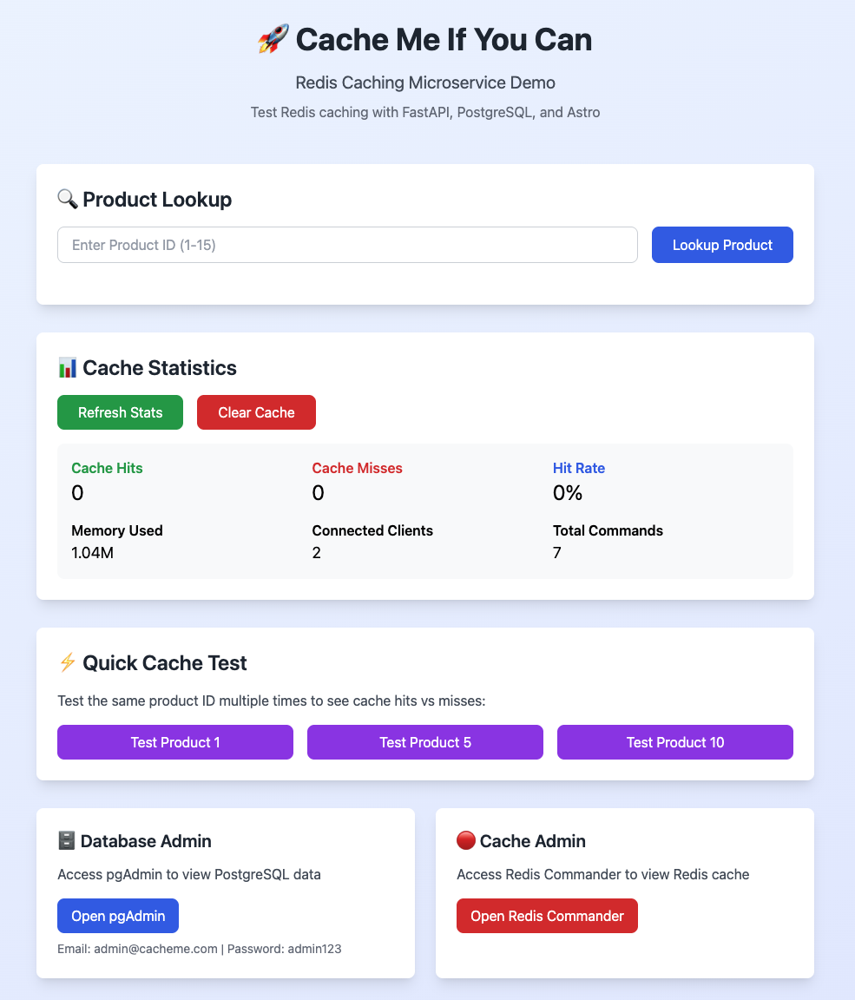
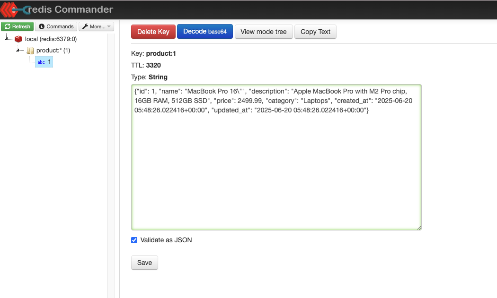
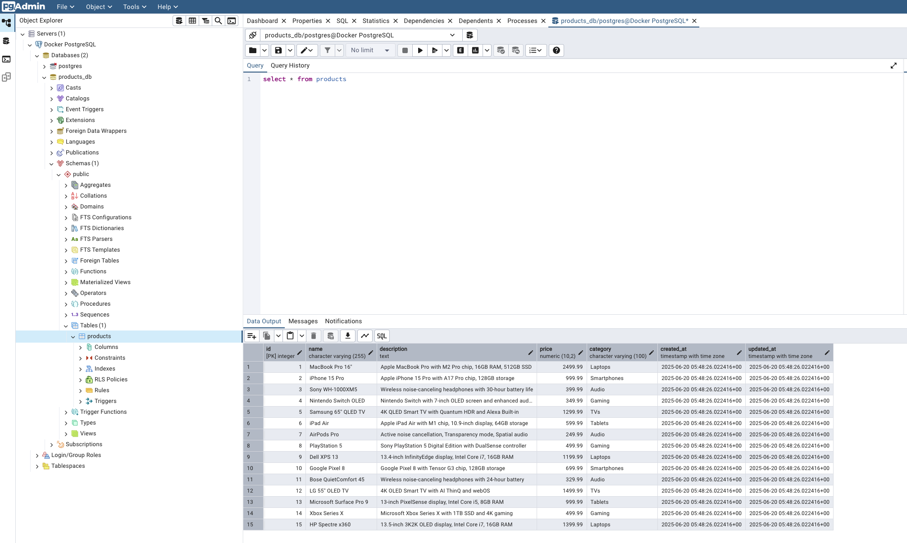
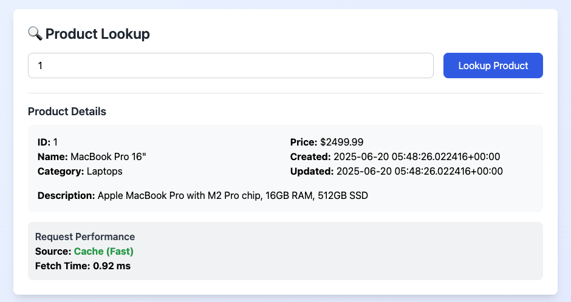
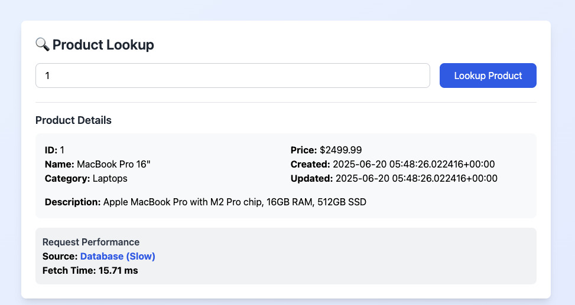
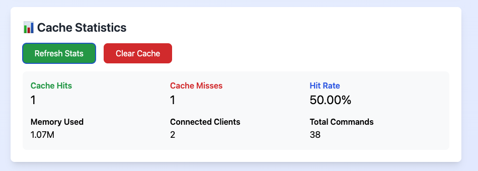

# 🚀 Cache Me If You Can

A comprehensive, production-ready microservice project designed to teach Redis caching patterns through hands-on experience. Features FastAPI backend, PostgreSQL database, Redis cache, and an interactive Astro frontend with **real-time performance metrics**.

Perfect for learning cache-aside patterns, Docker orchestration, and microservice architecture in a realistic development environment.


*The main testing interface with real-time performance metrics and cache statistics*

## 🔧 Tech Stack

| Component     | Tool/Framework    | Version | Purpose                           |
|---------------|-------------------|---------|-----------------------------------|
| Backend       | FastAPI + Uvicorn | Python 3.12.3 | RESTful API service               |
| Database      | PostgreSQL        | 15.6    | Primary data store                |
| Cache         | Redis             | 7.2.5   | High-performance caching layer    |
| Frontend      | Astro + Tailwind  | Node 20.12.0 | Interactive testing interface     |
| DB Admin      | pgAdmin           | 9.4     | PostgreSQL management UI          |
| Cache Admin   | Redis Commander   | Latest  | Redis visualization & management  |
| Orchestration | Docker Compose    | Latest  | Service coordination              |

## 🏗️ Architecture

```ascii
┌──────────────────┐   GET /products/{id}   ┌──────────────────┐
│                  │──────────────────────→│                  │
│  Astro Frontend  │                        │  FastAPI Backend │
│ (localhost:3000) │←──────────────────────│ (localhost:8000) │
│                  │  4. JSON + Metrics     │                  │
└──────────────────┘                        └─────────┬────────┘
                                                      │
                                                      │ 1. Check Redis
                                                      │
                                            ┌─────────▼─────────┐
                                            │                   │
                                            │    Redis Cache    │
                                            │ (localhost:6379)  │
                                            └─────────┬─────────┘
                                                      │
                                          ┌───────────┴───────────┐
                                          │                       │
                                     ✅ Cache Hit           ❌ Cache Miss
                                          │                       │
                               (2ms response)                     │
                                                                  ▼
                                                     ┌─────────────────────┐
                                                     │                     │
                                                     │ PostgreSQL Database │
                                                     │  (localhost:5432)   │
                                                     └──────────┬──────────┘
                                                                │
                                                                │ 2. Query DB
                                                                │ (50-200ms)
                                                                │
                                                     3. Cache result & return
```

## 🚀 Quick Start

**Prerequisites:** Docker (20.10+), Docker Compose (2.0+), ports 3000, 8000, 5432, 6379, 5050, 5540 available, 2GB+ RAM

**1. Launch Services**
```bash
# Start all services (first run will build images)
docker compose up -d --build

# Check all services are healthy
docker compose ps
```

**2. Access Applications**

| Service | URL | Credentials | Purpose |
|---------|-----|-------------|---------|
| **Frontend** | http://localhost:3000 | None | Main testing interface |
| **API Docs** | http://localhost:8000/docs | None | Interactive API documentation |
| **pgAdmin** | http://localhost:5050 | `admin@cacheme.com` / `admin123` | Database management |
| **Redis Commander** | http://localhost:5540 | None | Cache visualization |


*Redis Commander interface showing cached product keys, data types, and TTL information*


*pgAdmin automatically configured with PostgreSQL connection and sample product data*

🎉 **Everything is pre-configured!** PostgreSQL initializes with 15 sample products, pgAdmin auto-connects to the database, and Redis Commander connects to the cache.

## 🧠 Understanding Redis Caching

**What is Redis?** Redis (Remote Dictionary Server) is an in-memory data structure store that serves as a database, cache, and message broker. Used by Twitter, GitHub, Instagram, and Snapchat.

**🚨 The Problem Redis Solves**
- **Traditional Issue**: Every user request hits the database directly
- **Result**: Slow response times, high server costs, poor user experience  
- **Redis Solution**: Cache frequently accessed data in memory for instant retrieval

**Real-World Use Cases:**
- **E-commerce**: Product catalogs, user sessions, shopping carts
- **Social Media**: User profiles, news feeds, trending content
- **Gaming**: Leaderboards, player stats, game state
- **Financial**: Stock prices, exchange rates, account balances
- **Content Delivery**: Web pages, API responses, search results

**Key Redis Advantages:**
- **🚀 Speed**: In-memory storage = microsecond response times
- **🗂️ Data Structures**: Strings, hashes, lists, sets, sorted sets, bitmaps
- **⏰ Smart Expiration**: Automatic data cleanup with TTL
- **🔄 Persistence**: Optional disk backup for data safety
- **📊 Monitoring**: Built-in statistics and performance metrics
- **🔧 Atomic Operations**: Thread-safe operations for concurrent access

**Cache-Aside Pattern (Our Implementation):**
1. **Application Request** → User wants product data
2. **Check Cache First** → Query Redis for cached product
3. **Cache Miss** → If not found, query PostgreSQL database
4. **Cache Population** → Store database result in Redis with TTL
5. **Cache Hit** → Next request gets data instantly from Redis
6. **Performance Win** → 10-100x faster response for subsequent requests

**Business Impact:**
- **Performance**: Sub-millisecond response times
- **Scalability**: Handle 10x more users with same infrastructure
- **Cost Savings**: Reduce database server requirements by 50-80%
- **User Experience**: Faster page loads = higher conversion rates
- **Reliability**: Less database load = fewer timeouts and errors

## ⚡ Performance & Features

> **💡 Local Environment Note**: Response times vary by system, but you'll always observe dramatic performance differences between cache hits and database queries.

 
*Redis cache hits vs PostgreSQL database queries - 5-50x performance improvement*

**Performance Expectations:**
| Scenario | Response Time | Source | Speed Improvement |
|----------|---------------|---------|-------------------|
| Cache Hit | ~2-15ms | Redis | **5-50x faster** |
| Cache Miss | ~20-300ms | PostgreSQL | Baseline |

**Interactive Features:**
- **Product Lookup**: Test individual products with real-time metrics
- **Quick Test Buttons**: One-click testing for products 1, 5, and 10
- **Performance Tracking**: Visual indicators for cache vs database responses
- **Cache Management**: Clear all cached data with one button
- **Real-Time Metrics**: Response time tracking, source identification, live statistics


*Live Redis cache statistics dashboard*

**Key Performance Indicators:**
- **Cache Hits/Misses**: Success vs fallback to database
- **Hit Rate**: `(Hits / (Hits + Misses)) × 100` - Target 80%+ in production
- **Memory Usage**: Current Redis memory consumption
- **Connected Clients**: Active connections (typically 2: backend + Redis Commander)
- **Total Commands**: All Redis operations since startup

## 🔧 API Reference

**Core Endpoints:**
```http
GET    /products/{id}     # Get product with caching & metrics
GET    /products          # List all products (paginated)
GET    /cache/stats       # Redis cache statistics  
DELETE /cache/clear       # Clear all cached data
GET    /health            # Service health check
```

**Product Response Format:**
```json
{
  "id": 1,
  "name": "Wireless Headphones",
  "category": "Electronics", 
  "price": 79.99,
  "description": "High-quality wireless headphones...",
  "created_at": "2024-01-01T00:00:00",
  "updated_at": "2024-01-01T00:00:00",
  "source": "cache",           // "cache" or "database"
  "fetch_time_ms": 2.45        // Processing time in milliseconds
}
```

**Cache Statistics Response:**
```json
{
  "cache_stats": {
    "keyspace_hits": 42,
    "keyspace_misses": 8, 
    "used_memory_human": "1.2M",
    "connected_clients": 2,
    "total_commands_processed": 156
  }
}
```

## 🛠️ Management & Troubleshooting

**Volume Management:**
```bash
# List all project volumes
docker volume ls | grep cache-me

# Volume purposes:
# cache-me-postgres-data        → Database files
# cache-me-redis-data          → Cache persistence  
# cache-me-pgadmin-data        → Admin configuration
# cache-me-frontend-node-modules → Dependencies

# Complete reset (removes all data)
docker compose down -v
```

**Common Issues & Solutions:**

**🔴 Services won't start**
```bash
# Check port conflicts
netstat -tulpn | grep -E ':(3000|8000|5432|6379|5050|5540)'
# View service logs
docker compose logs <service-name>
```

**🔴 Database connection issues**
```bash
# Reset database volume
docker compose down
docker volume rm cache-me-postgres-data
docker compose up -d
```

**🔴 Cache not working**
```bash
# Check Redis connectivity
docker compose exec backend redis-cli -h redis ping
# View backend logs
docker compose logs -f backend
```

**🔴 pgAdmin server not auto-configured**
```bash
# Reset pgAdmin configuration
docker compose down
docker volume rm cache-me-pgadmin-data
docker compose up -d
```

**Performance Issues:**
- **Slow responses**: Check Docker resource allocation (increase RAM/CPU)
- **High memory usage**: Clear cache via UI or restart Redis container
- **Connection timeouts**: Ensure all services are healthy: `docker compose ps`

**Monitoring:**
```bash
# Follow all service logs
docker compose logs -f

# Monitor specific service
docker compose logs -f backend

# Check service health
docker compose ps

# Test API health
curl http://localhost:8000/health
```

